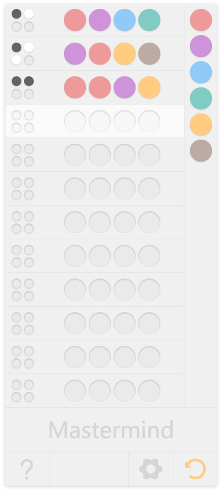

# Mastermind

Mastermind（又名珠玑妙算或码碁）是一款经典的逻辑推理游戏，通常是由两个人玩，一个是编码者（出谜者），另一个是解码者（猜谜者）。游戏的目标是解码者通过一系列猜测来确定由编码者设置的秘密代码。

- [玩法介绍](./howToPlay.zh-CN.md).

Mastermind is a classic code-breaking logic game that challenges players to use their deductive reasoning skills. The game is typically played between two people: one person acts as the "codemaker," who sets up a secret code, and the other person is the "codebreaker," whose goal is to decipher the code.

- [How To Play](./howToPlay.en.md).
- [Mastermind (board game)](https://en.wikipedia.org/wiki/Mastermind_(board_game))

## 游戏界面 - Game UI

